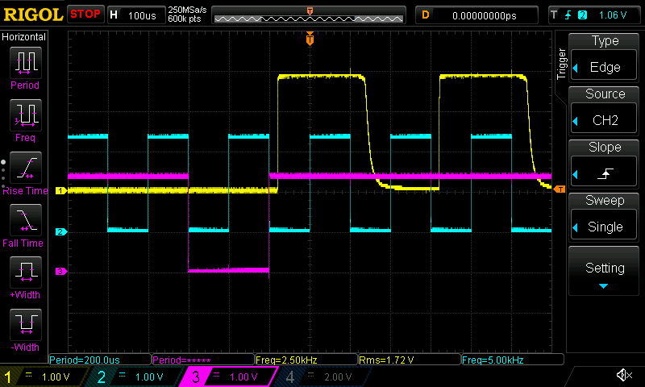

SPI captures from traffic between MCU and ADC board
===================================================

The SPI clock frequency is 2.6 kHz.

* [boot.txt](boot.txt): Initial power-on.
* [all_modes.txt](all_modes.txt): Activating each measurement mode in turn with SCPI commands. There may be some problems here because the SCPI interface does not seem to always behave reliably.
* [measurement_modes.md](measurement_modes.md): Decoded info on how specific measurement modes work.

Considerations for max clock rate
---------------------------------

HY3131 is capable of quite high samplerates, but SPI bus speed is limited by the optocoupler speed.
Critical path is from SCK to MISO, because it goes twice through optocouplers.
The observed delay is 50 microseconds.

The original firmware runs SPI in CPHA = 0, CPOL = 0 mode, where slave
writes on falling edge and master reads on rising edge.
The clock rate is so slow that the SPI has to be bitbanged, the SPI peripheral
cannot be clocked slow enough.
When bit banging, the MISO reading can be delayed to the next falling edge,
making 10 or 20 kHz SPI clock rate possible.

The image below is measured at ADC board on the connector going to MCU board:

The spikes can be eliminated by setting microcontroller pins to 2 MHz mode:

